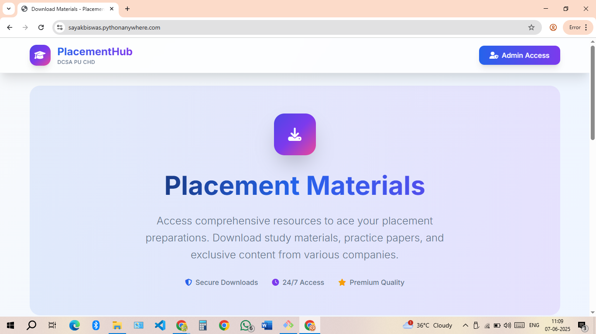
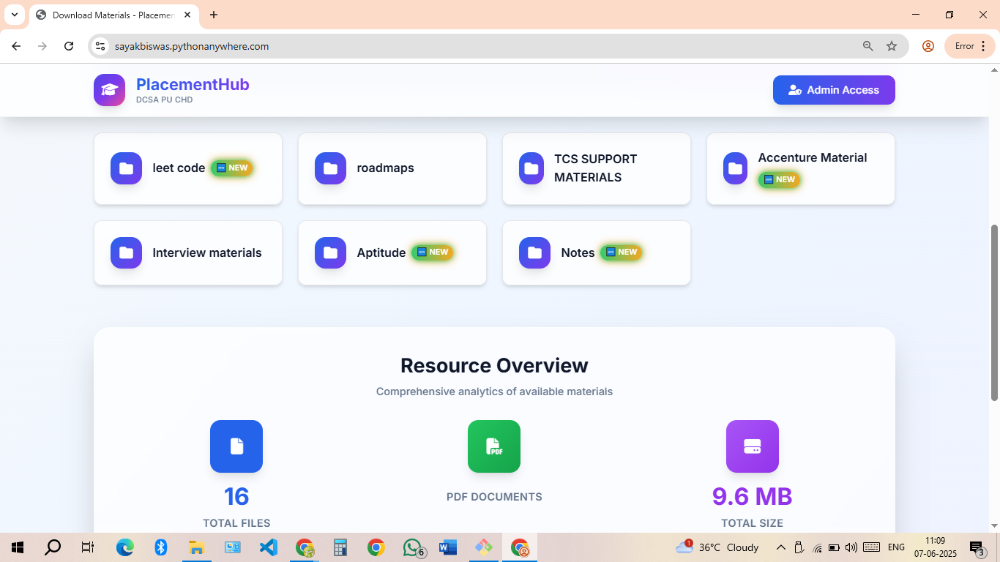
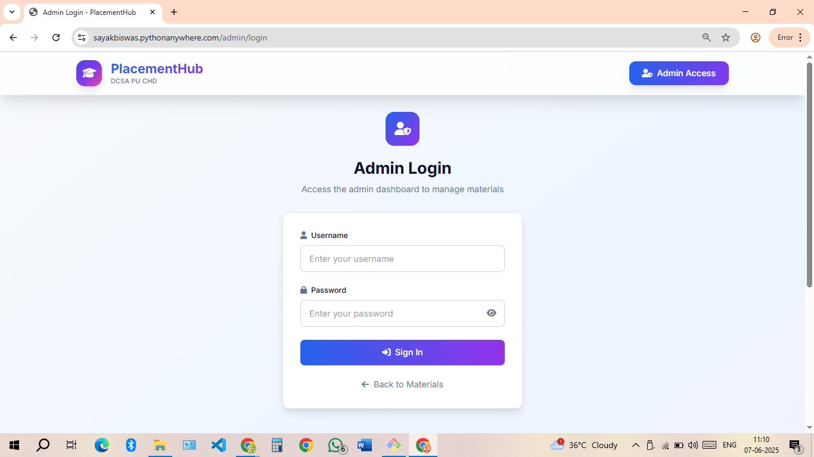
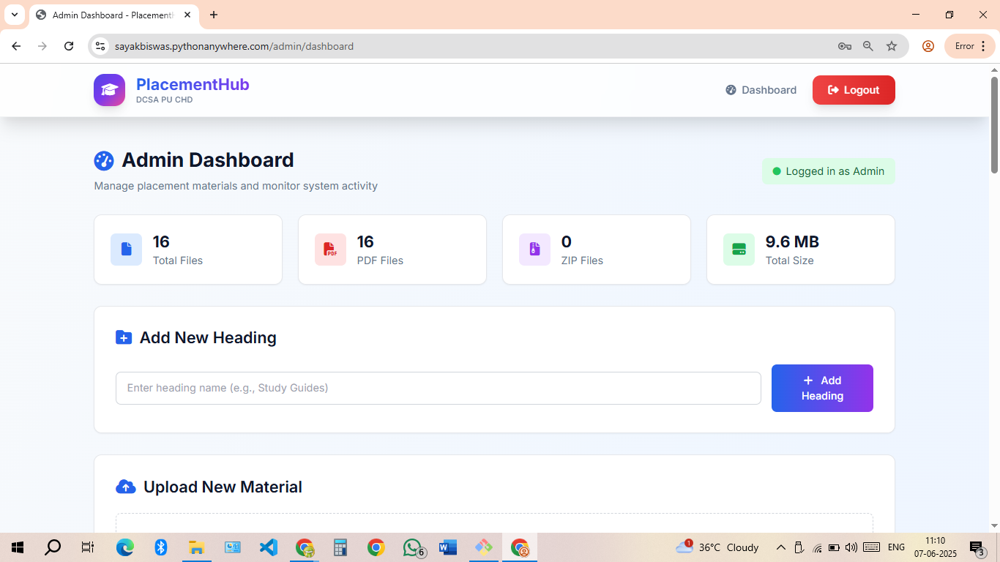
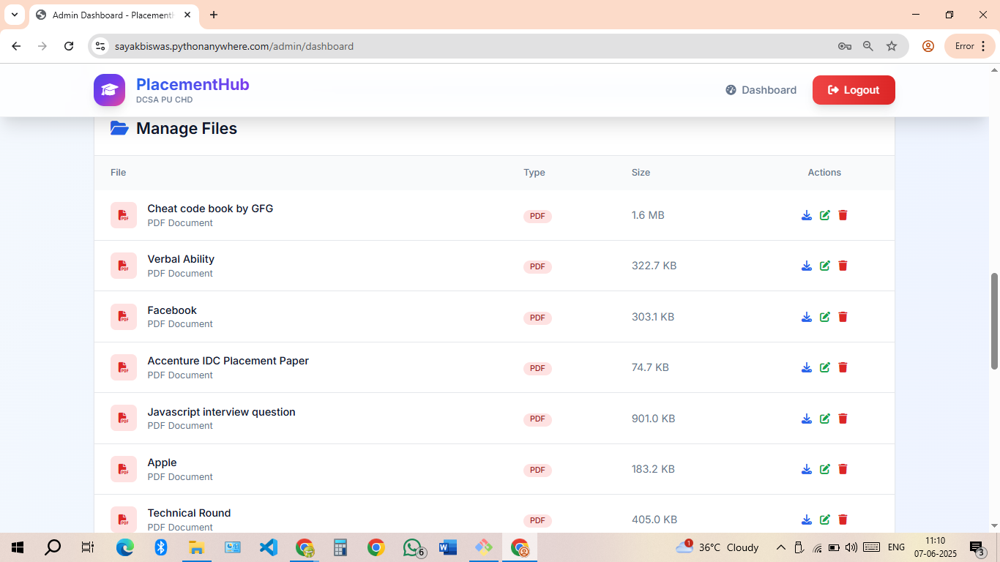
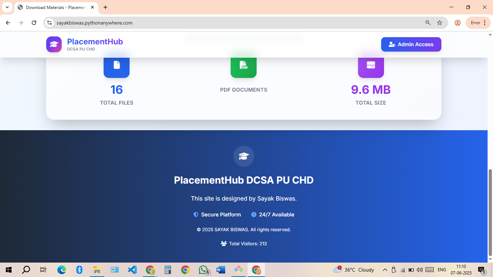
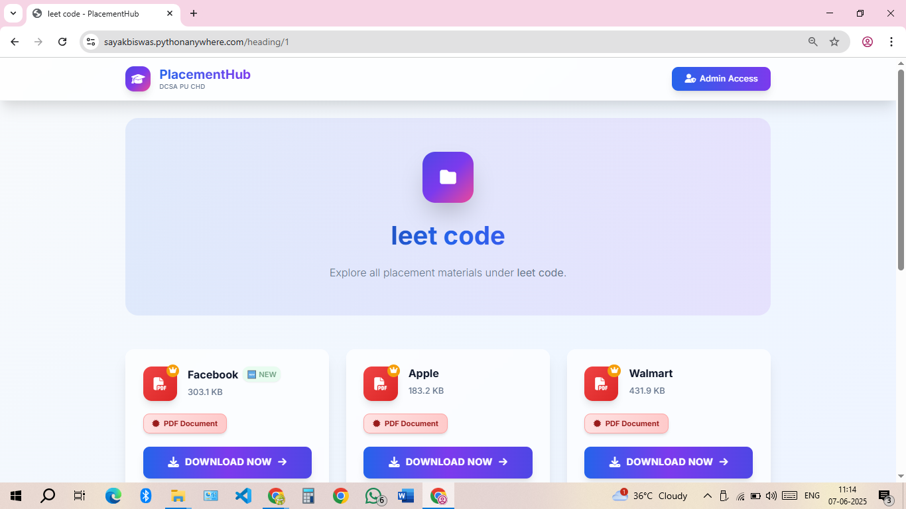

# 🎓 Placement Hub – Centralized Platform for Placement Preparation

A full-stack web application developed for the **Department of Computer Science and Applications (DCSA)**, designed to make placement preparation seamless and accessible. Placement Hub provides categorized, downloadable study materials with advanced features like admin control, analytics, and more.

🔗 **Live Site**: [Visit Placement Hub](https://sayakbiswas.pythonanywhere.com/)

---

## 📘 About This Project

**Placement Hub** is a web platform to help students access and manage placement preparation materials in an organized, intelligent, and trackable manner.

Created with the goal of assisting fellow students and juniors from the **Department of Computer Science and Applications**, this tool simplifies access to important resources and provides real-time usage insights for admins.

---

## 🧠 Why Placement Hub?

🎯 Designed to solve the problem of unstructured placement resources  
📂 Clean categorization of files  
📈 Real-time tracking of downloads and visitors  
🔒 Admin panel to manage materials  
💡 Analytics to monitor which files are most useful

---

## 🌟 Key Features

- ✅ **Admin Dashboard** for secure login and file uploads  
- ✅ **Downloadable Study Materials** grouped by topics  
- ✅ **Real-time Download Counter** stored in `counter.json`  
- ✅ **Visitor Analytics** to track student engagement  
- ✅ **Categorized Filters** for easy navigation  
- ✅ **Fully Responsive Design** (mobile-friendly)  
- ✅ **Live Analytics Dashboard** to monitor usage trends  

---

## 🌐 Live Demo

📎 [Click to Visit the Live Deployed Site](https://sayakbiswas.pythonanywhere.com/)

---

## 🛠️ Tech Stack Breakdown

### 🖥️ Frontend
- **HTML5 & CSS3**
- **Bootstrap 4** for responsive design
- **Jinja2 Templating** via Flask

### ⚙️ Backend
- **Python 3**
- **Flask Framework** – lightweight backend with powerful routing and template rendering
- **Flask-Login** – secure admin authentication
- **Werkzeug Security** – password hashing and session management

### 🗃️ Data Management
- `counter.json` – tracks download counts per file  
- `visitor.json` – tracks site visits  
- `admin.json` – stores admin credentials (hashed)

### 📊 Analytics & Filters
- Dynamic UI rendering for filtered file display  
- Real-time stats displayed to the admin panel using AJAX

### ☁️ Hosting
- **PythonAnywhere (Free Tier)** – ideal for educational Flask apps with lightweight storage needs

---

## 📁 Project Structure

PlacementHub/
│
├── 🧾 static/ → CSS, JavaScript, fonts, icons, etc.
├── 🖼️ templates/ → HTML templates rendered with Jinja2
├── 📂 uploaded_files/ → Uploaded study materials (PDFs, DOCX, etc.)
│
├── 🧠 app.py → Main Flask application logic
├── 📊 counter.json → Tracks download counts of materials
├── 👁️ visitor.json → Logs site visit information
├── 🔐 admin.json → Stores admin login data (hashed credentials)
├── 📘 README.md → Project documentation (you're here!)

---

## 📸 Screenshots

Visual overview of the Placement Hub platform.

---

### 🏠 Homepage

|  |  |
|----------------------------------------|----------------------------------------|
| Homepage View 1                        | Homepage View 2                        |

---

### 🔐 Admin Login Panel



---

### 📤 File Upload Section

|  |  |
|-------------------------------------|-------------------------------------|
| Upload Interface Step 1             | Upload Interface Step 2             |

---

### 📈 Analytics Dashboard

|  |  |
|-----------------------------------|-----------------------------------|
| Downloads Overview                | Visitor Insights                  |

---

### 📥 Downloadable Materials View



---

## 🚀 Deployment Steps (PythonAnywhere)

1. Sign up at [pythonanywhere.com](https://www.pythonanywhere.com)
2. Upload project files via the **Files** tab
3. Open the **Web** tab and:
   - Set your working directory
   - Point WSGI to `app.py`
4. Install Flask in the **Bash console**:
   ```bash
   pip install flask
Reload the app — and you’re live!

📬 Want the Code?
This project is not public yet.
If you'd like access to the source code:

📧 Email: sayakbiswas31.career@gmail.com
💬 Or reach out on LinkedIn

👨‍💻 Developer Info
Sayak Biswas
🎓 MCA Student | 💻 Developer | 📚 Placement Committee Member
📍 Department of Computer Science and Applications

🔗 LinkedIn: linkedin.com/in/sayak-biswas-a87282177

💻 GitHub: github.com/sayakbiswas31

📬 Email: sayakbiswas31.career@gmail.com

🤝 “Built by a student, for students — empowering placement success through organized access.”

📝 License
This project is built for academic and educational use. You may reuse or customize it with credit to the author
